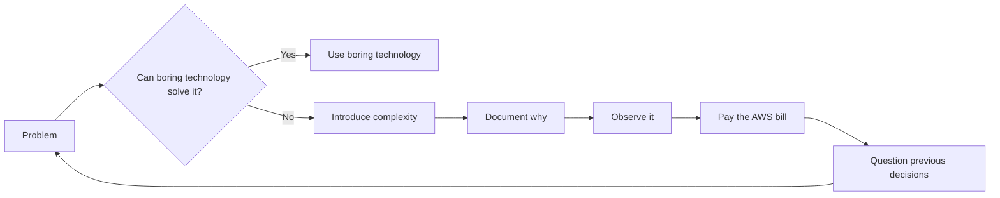

<div align="center">

# Fairhelm Systems

### Governed software systems for institutions where reliability is non-negotiable.

**Software Products · Data Systems · Operational Intelligence**

[](https://fairhelmsystems.com)
[](https://squarecampus.com)

</div>

---

## `> whoami`

**Fairhelm Systems** builds and operates software products and governed data systems for organizations where *“we'll reconcile it in Excel later”* is not an acceptable architectural strategy.

Our flagship product is **[SquareCampus](https://squarecampus.com)** — a School Operating System for schools, colleges, education trusts, and multi-campus institutions.

Alongside it, we selectively engineer:

- production-grade **ETL / ELT and data pipelines**
- **operational dashboards and command surfaces**
- governed **AI and intelligence systems**
- cloud systems where **cost, observability, recovery, and security** are considered before the incident report

Our general philosophy is rather simple:

> **Software should remain understandable after the engineer who built it has gone home.**

Preferably even after they have resigned.

---

## 🏫 SquareCampus

### One login. One timeline. One truth.

[SquareCampus](https://squarecampus.com) is built as an institutional operating system rather than a loose federation of modules held together by exports, spreadsheets, and optimism.

It connects:

```text
Admissions ──┐
Academics ───┤
Attendance ──┤
Finance ─────┤
Communication├──> Shared Institutional Core
Compliance ──┤              │
Operations ──┤              ├── Identity
Documents ───┘              ├── Workflow
                            ├── Governance
                            ├── Audit
                            └── Intelligence
```

The idea is not particularly exotic.

A student should not become six different students merely because six different modules need to know who they are.

SquareCampus therefore treats the institution as one governed operating model:

**System of Record → System of Workflow → System of Governance → System of Intelligence**

Leadership gets current operational state.  
Exceptions get owners.  
Overrides leave trails.  
Permissions have boundaries.

And somewhere, peacefully, an unnecessary spreadsheet stops being emailed.

---

## 🧠 AEGIS

**Adaptive Enterprise Governance & Intelligence System**

AEGIS is the governed intelligence layer inside SquareCampus.

Not:

```python
response = llm("Here is the entire database. Good luck.")
```

More like:

```python
context = authorize(
    user=user,
    tenant=tenant,
    role=role,
    scope=scope,
)

answer = aegis.ask(
    question=question,
    context=context,
    source_grounded=True,
    audit=True,
)
```

AEGIS is designed around a fairly unfashionable idea:

### AI should have permissions too.

It operates inside the same institutional boundaries as the rest of the platform — with role-aware access, source-grounded answers, auditability, and deliberately constrained authority.

**Read-only first. RBAC-aware. Audit-backed. Explainable.**

Because adding an LLM to a governance problem without governance merely creates a considerably faster governance problem.

---

## ⚙️ Engineering

We like systems that are:

| Property | Our preferred state |
|---|---|
| Access | Least privilege |
| Data | Reconciled |
| Pipelines | Idempotent |
| Failures | Observable |
| Retries | Deliberate |
| Changes | Auditable |
| Tenants | Separated |
| Dashboards | Based on trusted data |
| Cloud bills | Explainable |
| AI | Governed |
| `TODO: fix later` | Under surveillance |

### Some operating principles

```text
If correctness matters, prove it.

If a process can fail, define the failure path.

If an operation can retry, make it idempotent.

If a metric drives a decision, define the metric.

If access exists, define why.

If data crosses a boundary, know which boundary.

If the dashboard is green because nobody instrumented the failure...
the dashboard is not green.
```

And most importantly:

> **Batch when batch is enough. Events when events earn their complexity.**

Distributed systems are not Pokémon.

We do not need to collect them all.

---

## 📊 Data Engineering

Moving bytes is easy.

Establishing that the bytes are **correct, complete, current, attributable, recoverable, and actually mean what somebody thinks they mean** is where the evening disappears.

Our data work focuses on:

```text
Sources
   │
   ▼
Ingestion
   │
   ▼
Validation
   │
   ├──────> Exceptions ──> Someone actually owns these
   │
   ▼
Transformation
   │
   ▼
Reconciliation
   │
   ▼
Decision-ready models
   │
   ▼
Operational surfaces
```

With the usual suspects:

`lineage` · `reconciliation` · `schema drift` · `freshness` · `observability` · `retries` · `recovery` · `cost discipline`

A connector is not a data platform.

A successful HTTP `200` is not proof that the numbers are correct.

And a pipeline that only works while its author is watching it is technically a demo.

---

## 📈 Dashboards

We build operational dashboards around **trusted KPIs, exceptions, ownership, and action**.

Not decoration.

Not forty-seven pie charts arranged according to the ancient principles of executive feng shui.

A dashboard should help answer:

```text
What changed?
Why did it change?
Can I trust this number?
Who owns the exception?
What happens next?
```

If it cannot answer those questions, it may still be beautiful.

It just isn't a command surface.

---

## 🔐 Security & Governance

We believe:

### Trust is an architecture, not a badge.

So our systems are designed around:

- role-based access control
- least privilege
- explicit tenant boundaries
- auditable material actions
- controlled network paths
- managed secrets
- encryption in transit and at rest
- recoverable operations
- privacy-conscious data handling

We also try very hard not to decorate websites with security certifications we haven't earned.

Apparently this is called **restraint**.

---

## 🛠️ Our relationship with complexity

We are not opposed to complexity.

Complexity is often unavoidable.

We are opposed to complexity arriving at the architecture meeting wearing sunglasses and claiming:

> *“Netflix does it.”*

For every sufficiently exciting architecture diagram, there exists a PostgreSQL instance quietly wondering why nobody asked it first.



---

## 🌐 Find us

### Fairhelm Systems
[**fairhelmsystems.com**](https://fairhelmsystems.com)

Governed software systems, data engineering, operational dashboards, and institutional technology.

### SquareCampus
[**squarecampus.com**](https://squarecampus.com)

A School Operating System for serious institutions.

---

<div align="center">

### Built in India. 🇮🇳

**For systems that cannot afford operational drift.**

<br>

`correctness > cleverness` &nbsp;·&nbsp;
`evidence > assumptions` &nbsp;·&nbsp;
`boring > broken`

<br><br>

<sub>
Most production incidents begin with a sentence containing the words<br>
<strong>"it should be fine."</strong>
</sub>

</div>

<!--
Hello, engineer.

Yes, you opened the source of an already-open-source README.

We respect the commitment.

If you're looking for secrets, there aren't any here.
If you're looking for TODOs, please speak to management.
-->
